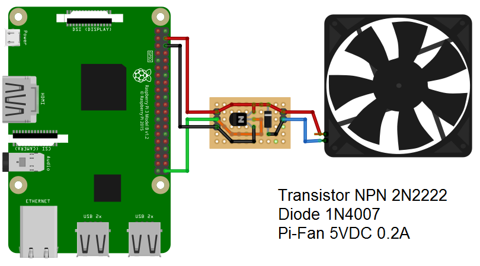
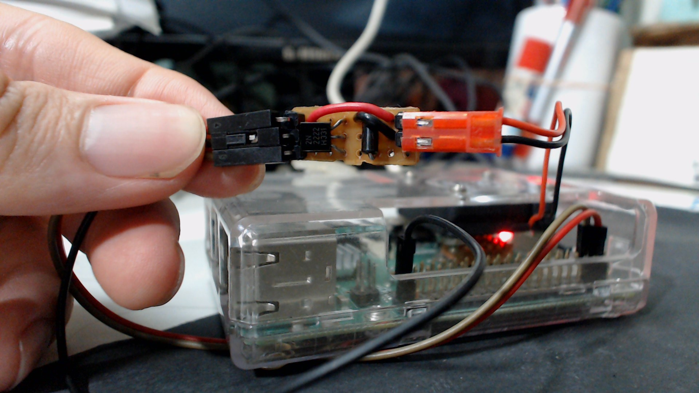

# raspberrypi-cpu-cooling-fan-control

## Clone repository
```
$ cd ~/Desktop
$ git clone https://github.com/TaLucGiaHoang/raspberrypi-cpu-cooling-fan-control.git
$ cd raspberrypi-cpu-cooling-fan-control
```

## Connection


### Hardware components
  * Raspberry Pi 3 B+
  * Pi-Fan 5VDC 0.2A
  * Transistor NPN 2N2222
  * Diode 1N4007 (1A 1000V)


## To read tempreture of raspberry pi CPU
```
$ cat /sys/class/thermal/thermal_zone0/temp
```

## Configure to auto-run fan after reboot
`$ crontab -e`

Then add below line and save:
```
@reboot python <raspberrypi-cpu-cooling-fan-control folder>/fan_ctrl.py
```

## My demonstration


## References:
- Run a task on reboot (https://www.raspberrypi.org/documentation/linux/usage/cron.md)
- This project was made base on this tutorial (https://www.instructables.com/id/PWM-Regulated-Fan-Based-on-CPU-Temperature-for-Ras/)
